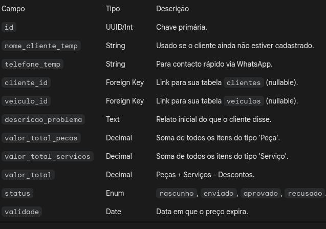
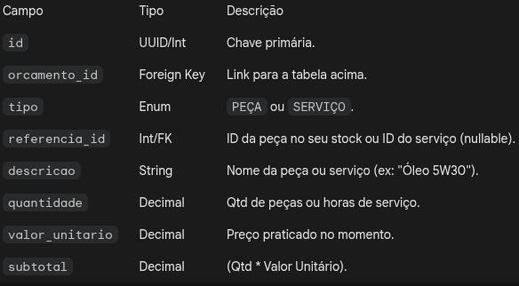

## Orçamento

* nome do cliente, nome da peça, valor da peça, tipo de serviço, e valor do serviço, e valor total(`VALOR_PECA+VALOR_SERVICO`)

##### QUERY

`

    SELECT
        cli.NOME AS "CLIENTE",
        p.NOME_PECA AS "PEÇA",
        p.VALOR_PECA AS "VALOR DA PEÇA",
        s.TIPO_SERVICO AS "SERVIÇO",
        s.VALOR_SERVICO AS "VALOR DO SERVIÇO",
        (p.VALOR_PECA + s.VALOR_SERVICO) AS "VALOR TOTAL"
    FROM
        (SELECT NOME FROM CLIENTE LIMIT 1) cli
    CROSS JOIN
        (SELECT NOME_PECA, VALOR_PECA FROM PECA WHERE COD_PECA = 1) p
    CROSS JOIN
        (SELECT TIPO_SERVICO, VALOR_SERVICO FROM SERVICO WHERE ID = 1) s;
`
##### 1. Tabela orcamentos (Cabeçalho)
   Esta tabela armazena os dados básicos. Note que o cliente_id e o veiculo_id devem ser opcionais (nullable) nesta fase, 
   para permitir o "Orçamento Rápido" que discutimos.

##### 2. Tabela orcamento_itens (O detalhe)
Em vez de ter campos fixos na tabela pai, use uma tabela de itens. Isso permite que um orçamento tenha 1 ou 50 peças/serviços.

### O segredo da conversão: Orçamento -> OS
##### Para o seu sistema ser profissional, adicione um campo na sua tabela de OS existente:

* `orcamento_id (Foreign Key - Nullable)`

##### O Fluxo no Código:

* O `usuário` cria o Orçamento.
* O `cliente` aprova.
* Se o `cliente` for novo, o sistema abre um modal para finalizar o cadastro de `cliente` e veiculo.
* O sistema cria um registo na tabela os, copia todos os itens de `orcamento_itens` 
  para a sua tabela de `os_itens` e muda o status do orçamento para convertido.

##### Exemplo de JSON para o seu Backend (POST /orcamentos)

Para você visualizar como os dados chegariam do Frontend:

`

    {
        "nome_cliente_temp": "João Silva",
        "telefone_temp": "11999999999",
        "validade": "2023-12-31",
        "itens": [
            {
            "tipo": "PEÇA",
            "descricao": "Pastilha de Freio Dianteira",
            "quantidade": 1,
            "valor_unitario": 150.00
            },
        {
            "tipo": "SERVIÇO",
            "descricao": "Mão de Obra de Troca de Pastilhas",
            "quantidade": 1,
            "valor_unitario": 80.00
            }
        ],
        "valor_total": 230.00
    }

`